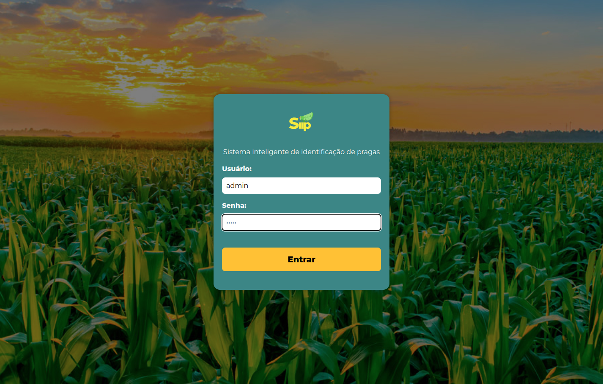
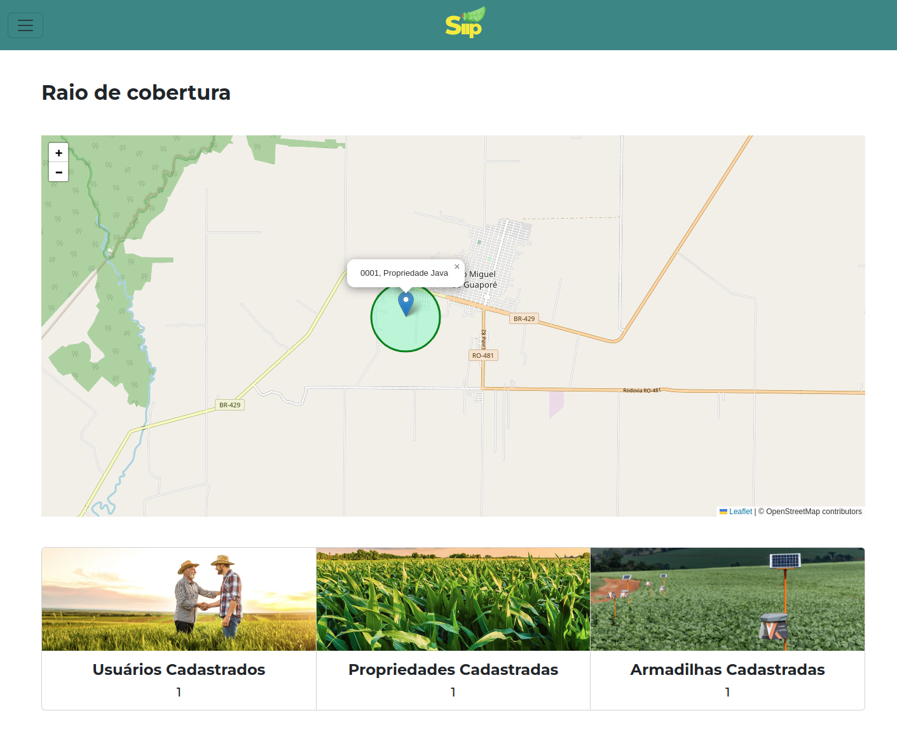
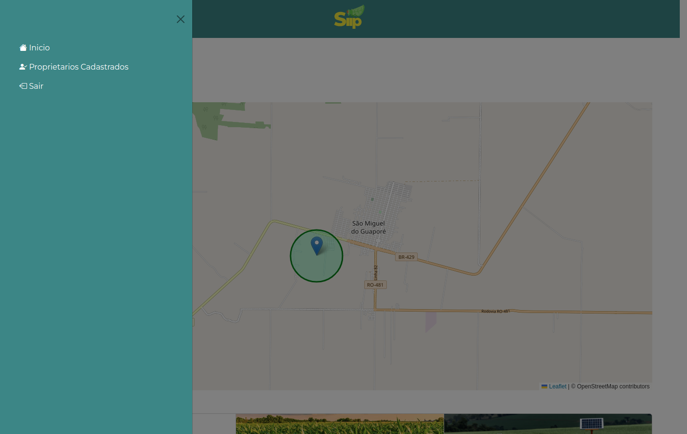
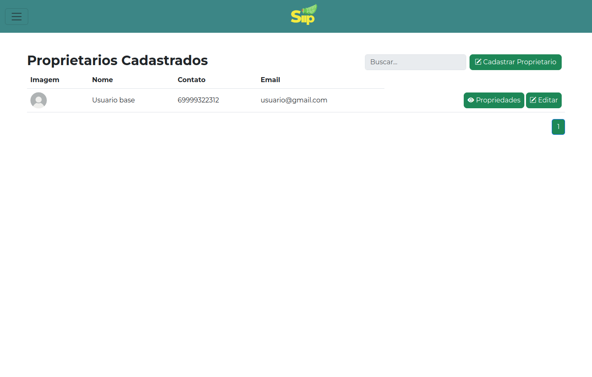
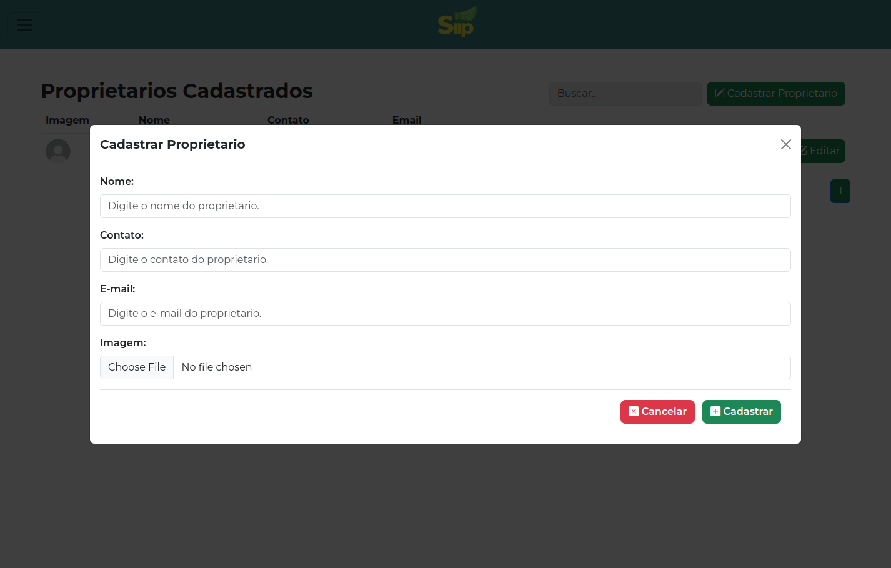
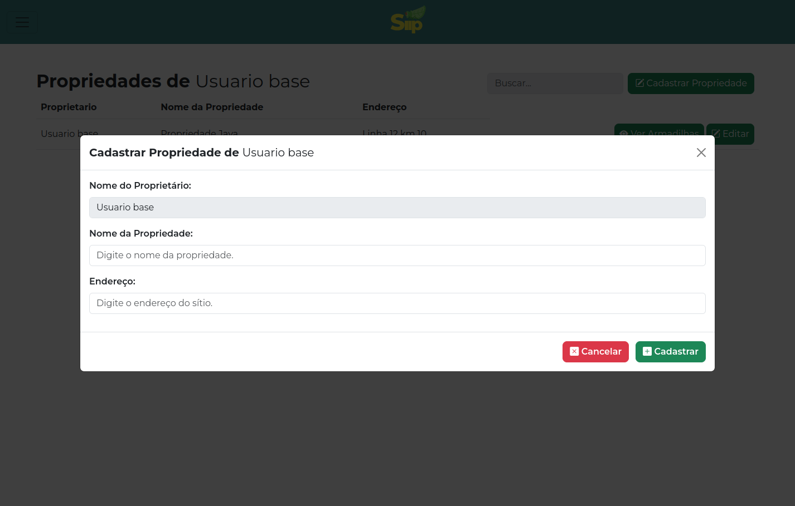

# Siip- Sistema Inteligente de Identificação de Pragas

## Descrição do Projeto
O projeto foi desenvolvido como parte do curso de Agrocomputação no Instituto Federal de Rondônia. Este projeto é um sistema de cadastro de armadilhas, permitindo aos usuários registrarem proprietarios, propriedades e armadilhas instaladas. Facilita o monitoramento e controle de insetos em ambientes agrícolas.

## Funcionalidades Principais
1. **Cadastro de Usuários:** Os usuários podem se cadastrar no sistema.

2. **Cadastro de Propriedades:** Após o login, os usuários podem cadastrar proprietarios.

2. **Cadastro de Propriedades:** Após o login, os usuários podem cadastrar propriedades.

3. **Cadastro de Armadilhas:** Após o login, dentro de cada propriedade, os usuários podem adicionar informações sobre armadilhas, como id e localização.


### Versão Atual: v1.0.0
- Funcionalidades básicas de cadastro de usuários, propriedades e armadilhas.
- Interface de usuário simples para navegação e interação.

## Interface
- Tela de login.
  

- Tela inicial.
  

- Menu lateral.
  

- Tela de proprietarios.
  

- Modal de cadastro de proprietarios.
  

- Modal de cadastro de propriedades.
  


## Instalação

use Python 3.10.

new venv:
```sh
pip install -r requirements.txt
```
update venv:
```sh
pip freeze > requirements.txt
```
